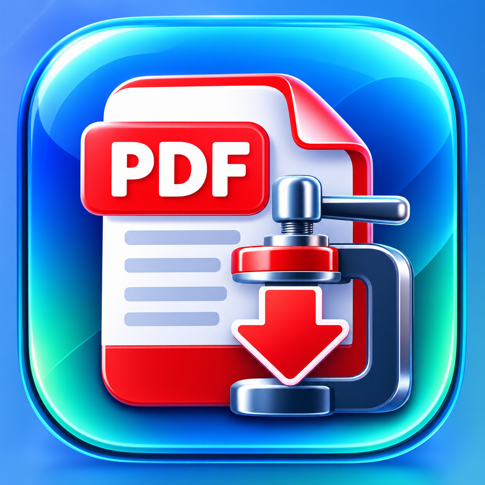

<div dir="rtl">

<p align="center">
  
</p>

# 📄 تقليص PDF

أداة عربية متقدمة لتقليص وضغط ملفات **PDF** مباشرة داخل المتصفح، مع المحافظة قدر الإمكان على جودة الملف وخصوصيته.

يتم تنفيذ المعالجة محليًا على جهازك، ولا يتم رفع ملفات PDF إلى أي خادم.

## 🌐 تشغيل البرنامج

### ▶️ [فتح برنامج تقليص PDF](https://adelss12.github.io/taqlis-pdf/)

يعمل البرنامج مباشرة من المتصفح على الكمبيوتر والآيفون، ويمكن إضافته إلى الشاشة الرئيسية في الآيفون ليعمل كتطبيق ويب.

---

## ✨ المميزات

- ضغط وتقليص حجم ملفات PDF.
- معالجة الملفات محليًا داخل المتصفح.
- لا يتم رفع ملفاتك إلى خادم خارجي.
- دعم سحب وإفلات ملفات PDF.
- إمكانية اختيار أكثر من ملف.
- عدة مستويات للضغط حسب الحاجة.
- وضع بدون فقد للجودة.
- وضع مناسب للعرض على الشاشة.
- وضع مناسب للطباعة.
- وضع أقصى ضغط للحصول على حجم أصغر.
- إمكانية التحكم في جودة الصور.
- أدوات وإعدادات متقدمة للمستخدم.
- إمكانية معالجة عدة ملفات دفعة واحدة.
- يعمل على الكمبيوتر والجوال.
- إمكانية إضافته إلى الشاشة الرئيسية كتطبيق ويب.
- يدعم العمل دون اتصال بعد تخزين ملفات التطبيق اللازمة.

---

## 🔒 الخصوصية

خصوصية الملفات من أهم مميزات البرنامج.

تتم معالجة ملفات PDF داخل المتصفح على جهاز المستخدم، ولا يتم إرسال الملفات إلى خادم خارجي من أجل تنفيذ عملية الضغط.

لذلك يبقى الملف الأصلي على جهازك أثناء عملية المعالجة.

---

## 🗜️ مستويات الضغط

يوفر البرنامج عدة خيارات لتناسب الاستخدامات المختلفة:

- **بدون فقد** — للمحافظة على الجودة قدر الإمكان.
- **للشاشة** — مناسب للعرض والمشاركة الإلكترونية.
- **للطباعة** — يحافظ على جودة أعلى مناسبة للطباعة.
- **أقصى ضغط** — للحصول على أصغر حجم ممكن مع تقليل جودة الصور عند الحاجة.

كما تتوفر إعدادات متقدمة للتحكم بصورة أدق في عملية الضغط.

---

## ⚠️ تنبيه مهم

هذه الأداة ما زالت تجريبية.

يقوم البرنامج بإنشاء **نسخة جديدة محسنة** من ملف PDF ولا يعدّل الملف الأصلي.

قد تظهر في بعض الملفات اختلافات في العرض أو بعض المحتويات بعد الضغط، لذلك يُنصح دائمًا بمراجعة الملف الناتج قبل حذف النسخة الأصلية.

تقليص الخطوط المضمنة متوقف افتراضيًا للمساعدة في المحافظة على أعلى قدر من التوافق، ويمكن تفعيله من الإعدادات المتقدمة.

---

## 📱 إضافة البرنامج إلى شاشة الآيفون

1. افتح البرنامج في **Safari**.
2. اضغط زر **المشاركة**.
3. اختر **إضافة إلى الشاشة الرئيسية**.
4. تأكد من تفعيل **فتح كتطبيق ويب**.
5. اضغط **إضافة**.

سيظهر البرنامج باسم **PDF** مع أيقونته الخاصة ويمكن تشغيله مباشرة من الشاشة الرئيسية.

---

## 💻 التشغيل محليًا للمطور

يتطلب المشروع Node.js.

```bash
npm install
npm run dev
```

ثم افتح العنوان المحلي الذي يظهر في الطرفية.

---

## 🛠️ التقنيات

يعتمد المشروع على مجموعة من تقنيات ومكتبات الويب، من بينها:

- `pdf-lib`
- `fflate`
- `jpeg-js`
- `harfbuzzjs`
- `Vite`
- `Vitest`
- `vite-plugin-pwa`

---

## 📲 تطبيق ويب PWA

يدعم المشروع العمل كتطبيق ويب تقدمي **PWA**.

يتم تخزين ملفات التطبيق الأساسية محليًا بعد تحميلها، مما يسمح باستخدام وظائف البرنامج دون اتصال بالإنترنت بعد تجهيز التطبيق وتخزين موارده اللازمة.

---

## 🙏 أصل المشروع

هذا المشروع مبني على مشروع **PDF-A-go-slim** وتم تخصيص واجهته وتطوير النسخة العربية لتناسب الاستخدام العربي.

المشروع الأصلي:

[PDF-A-go-slim](https://github.com/khawkins98/PDF-A-go-slim)

---

## 📜 الترخيص

المشروع يستخدم ترخيص **MIT** وفق الترخيص الموجود في المستودع.

---

### تطوير وتخصيص النسخة العربية

**عادل الغامدي — 2026**

</div>
